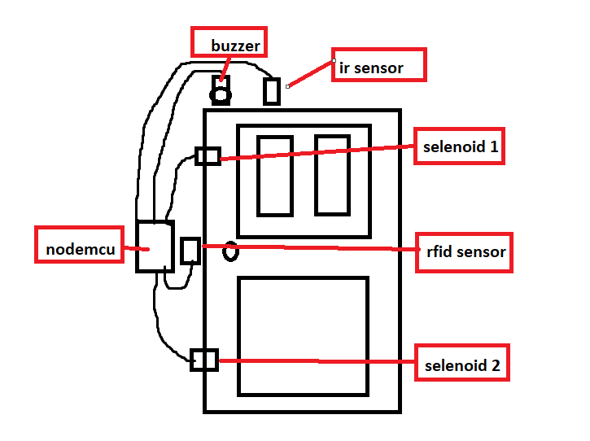

# RFID-HOME-SECURITY(SMARTODE)

This is tutorial with NodeMCU (**ESP 8266**) for smart home sercurity and send a notification to telegram bot.

the tutorial we can use PlatformIO in the Visual Studio Code (**VSCOD**E) for easy mobility in my code environment.

first you can edit and remark if you need to custom this project with your needed.

**Dependencies for needed :**

1. Arduino
2. WiFiClientSecure
3. ArduinoJson
4. UniversalTelegramBot
5. ESP8266WiFi
6. MFRC522
7. SPI

**Hardware requirement :**

1. NodeMCU (ESP8266)
2. Relay 2 Channel
3. Jumper Wire
4. Selenoid Door Lock
5. RFID MFRC522

**Software support :**

1. Visual Studio Code or you can user Arduino IDE
2. Telegram

**Electrical Module Schematics**

